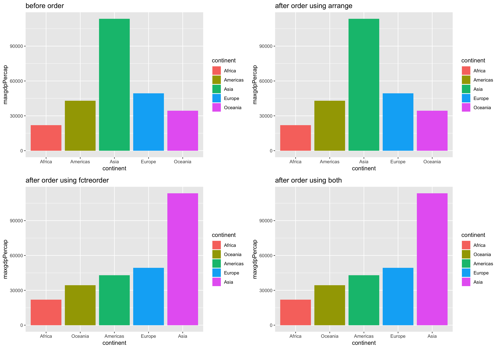

This file is the Rmd file of *Homework 05* of the course STAT545A, taught by [Vincenzo Coia](https://github.com/vincenzocoia) at the University of British Columbia (UBC). The detailed requirements of this assignment could be found [here](http://stat545.com/Classroom/assignments/hw05/hw05.html). The STAT545A course page is [here](http://stat545.com/Classroom/). My own participation repository is [here](https://github.com/ParkerLi/STAT545_participation). The goal of this assignment is to 

1. Reorder a factor in a principled way based on the data and demonstrate the effect in arranged data and in figures.
2. Write some data to file and load it back into R.
3. Improve a figure (or make one from scratch), using new knowledge, e.g., control the color scheme, use factor levels, smoother mechanics.
4. Make a plotly visual.
5. Implement visualization design principles.

# Bring Data In 

This section loads all the necessary packages. To disable all the conflicts/warning and other messges, I utilized the <code>suppressPackageStartupMessages</code> function I learned from class. Another way to do this is to use <code>Message=F</code> or <code>warn.conflicts=F</code> in the R chunk setting.

```{r preparation_00, message=F}
suppressPackageStartupMessages(library(gapminder))
suppressPackageStartupMessages(library(tidyverse))
suppressPackageStartupMessages(library(ggplot2))
suppressPackageStartupMessages(library(knitr))
suppressPackageStartupMessages(library(gridExtra))
suppressPackageStartupMessages(library(plotly))
```

# Factor Management

__Drop Oceania__. Filter the Gapminder data to remove observations associated with the continent of Oceania. Additionally, remove unused factor levels. Provide concrete information on the data before and after removing these rows and Oceania; address the number of rows and the levels of the affected factors.

__Before Drop Oceania__:

```{r}
continent <- gapminder$continent
levels(continent)
rowbefore <- nrow(gapminder)
levelbefore <- nlevels(continent)
kable(fct_count(continent), col.names = c('continet', 'number of rows'))
kable(data.frame(number_of_levels_before_dropping = levelbefore, number_of_rows_before_dropping = rowbefore))
```

__Drop Oceania__

```{r}
noOceania <- gapminder %>% 
  filter(continent != 'Oceania') %>% 
  droplevels()
```

__After Drop Oceania__

```{r}
noOceaniacontinent <- noOceania$continent
levels(noOceaniacontinent)
rowafter <- nrow(noOceania)
levelafter <- nlevels(noOceaniacontinent)
kable(fct_count(noOceaniacontinent), col.names = c('continet', 'number of rows'))
kable(data.frame(number_of_levels_after_dropping = levelafter, number_of_rows_after_dropping = rowafter))
```

We can tell that the number of levels drops 1: Oceania; number of rows decreases 24 and all of them are from the Oceania category which is droppbed.

__Reorder the levels of country or continent__. Use the forcats package to change the order of the factor levels, based on a principled summary of one of the quantitative variables. Consider experimenting with a summary statistic beyond the most basic choice of the median.

__reorder the levels of <code>continent</code>__

I reorder the levels of continent by the maximum of gdpPercap.

__Before Reorder__

```{r}
beforereorder <- group_by(gapminder, continent) %>% 
  summarise(maxgdpPercap = max(gdpPercap)) #the reordering criteria
levels(beforereorder$continent)
kable(beforereorder)
```

__After Reorder__

```{r}
afterreorder <- mutate(beforereorder, continent = fct_reorder(continent, maxgdpPercap))
levels(afterreorder$continent)
kable(afterreorder)
```

__We can tell that the <code>fct_reorder</code> does not rearrange the dataframe. However, it does reorder the data in an elegant way__. See below:

```{r}
ggplot(beforereorder, aes(x = maxgdpPercap, y = continent)) +
  geom_point()
ggplot(afterreorder, aes(x = maxgdpPercap, y = continent)) +
  geom_point()
```

Taking it further: __what should we do if we want to reorder the dataframe too? <code>arrange</code> is a good function to work with__.

__<code>arrange()</code> Reorder the Dataframe__

```{r}
reorderarrange <- beforereorder %>% 
  arrange(maxgdpPercap)
levels(reorderarrange$continent)
kable(reorderarrange)
```

__Combining <code>arrange</code> and <code>fct_reorder</code> helps you reorder both the dataframe and plots/table__.

__Combing Reorder__

```{r}
reordeboth <- beforereorder %>% 
  arrange(maxgdpPercap) %>% 
  mutate(continent=fct_reorder(continent, maxgdpPercap))
levels(reordeboth$continent)
kable(reordeboth)
ggplot(reordeboth, aes(x = maxgdpPercap, y = continent)) +
  geom_point()
```

# File I/O

__Experiment with <code>write_csv()</code>/<code>read_csv()</code>__

```{r}
fileio <- group_by(gapminder, continent) %>% 
  summarise(maxgdpPecap = max(gdpPercap)) %>% 
  mutate(continent=fct_reorder(continent, maxgdpPecap))
str(fileio) #will compare with the readcsv later
levels(fileio$continent)
write_csv(fileio,"fileio.csv") #write csv
data <-read_csv("fileio.csv") #read csv
str(data)
```

Continent is a list (not a factor):<code>write_csv()</code>/<code>read_csv()</code> changes the variable characteristics.

__Experiment with <code>saveRDS()</code>/<code>readRDS()</code>__

```{r}
saveRDS(fileio, "fileio.rds")
dataRDS <-readRDS("fileio.rds")
str(dataRDS)
levels(dataRDS$continent)
```

Nothing changes.<code>saveRDS()</code>/<code>readRDS()</code> retains the order of the factor.

__Experiment with <code>dput()</code>/<code>dget()</code>__

```{r}
dput(fileio, "datar.R")
dataR <-dget("datar.R")
str(dataR)
levels(dataR$continent)
```

Nothing changes.<code>dput()</code>/<code>dget()</code> does not change anything.

# Visualization Design

Assignment requirement: Remake at least one figure or create a new one, in light of something you learned in the recent class meetings about visualization design and color. Maybe juxtapose your first attempt and what you obtained after some time spent working on it. Reflect on the differences. If using Gapminder, you can use the country or continent color scheme that ships with Gapminder. 

For this section, I visualize the __reorder the levels of <code>continent</code>__ process. A combined plot is shown here to compare and contrast different kinds of before/after reordering process.

__Making Plot__

```{r}
vd1 <- group_by(gapminder, continent) %>% 
  summarise(maxgdpPercap = max(gdpPercap))
plot1 <- ggplot(vd1, aes(continent, maxgdpPercap))+
  geom_bar(aes(fill=continent), position="dodge", stat="identity")+
  labs(x="continent", y="maxgdpPercap", title="before order")

vd2 <- arrange(vd1, maxgdpPercap)
plot2 <- ggplot(vd2, aes(continent, maxgdpPercap))+
  geom_bar(aes(fill=continent), position="dodge", stat="identity")+
  labs(x="continent", y="maxgdpPercap", title="after order using arrange")

vd3 <- mutate(vd1, continent=fct_reorder(continent, maxgdpPercap))
plot3 <- ggplot(vd3, aes(continent, maxgdpPercap))+
  geom_bar(aes(fill=continent), position="dodge", stat="identity")+
  labs(x="continent", y="maxgdpPercap", title="after order using fctreorder")

vd4 <- arrange(vd1, maxgdpPercap) %>% 
  mutate(continent=fct_reorder(continent, maxgdpPercap))
plot4 <- ggplot(vd4, aes(continent, maxgdpPercap))+
  geom_bar(aes(fill=continent), position="dodge", stat="identity")+
  labs(x="continent", y="maxgdpPercap", title="after order using both")

finalplot <- grid.arrange(plot1, plot2, plot3, plot4, nrow=2)
finalplot
```

Assignment requirement: Then, make a new graph by converting this visual (or another, if you’d like) to a plotly graph. What are some things that plotly makes possible, that are not possible with a regular ggplot2 graph?

__Converting into a Plotly Graph__

```{r}
#this is github_document, not html_document. but the code is here
#ggplotly(plot1)
# we can also try plot2, plot3, and plot4. 
#However, we cannot try finalplot. It will say "Error in UseMethod("ggplotly", p) 
#no applicable method for 'ggplotly' applied to an object of 
#class "c('gtable', 'gTree', 'grob', 'gDesc')""
```


__Benefits of  <code>plotly</code> over <code>ggplot2</code>__:

I got great help from this [website](https://www.bryanwhiting.com/2017/02/the-dataviz-battle-plotly-vs-ggplot2/), detailing the difference between <code>plitly</code> and <code>ggplot2</code>. A brief summarization of the advantages of <code>plotly</code> has over <code>ggplot2</code>:

<code>Plotly</code> and <code>ggplot2</code> are inherently for different purposes. <code>plotly</code> allows you to quickly create beautiful, reactive D3 plots that are particularly powerful in websites and dashboards. You can hover your mouse over the plots and see the data values, zoom in and out of specific regions, and capture stills. 

1. Plotly handles multiple wide data columns. 
2. Customizing the layout (plot borders, y axis) is easier.
3. Customizing the legend is easier 
4. Plotly syntax is very intuitive 
5. Plotly also works for Python, Matlab, and Excel, among other languages.
6. It’s very easy to add new series and customize them (one line, one scatter, and one bar, for example)
7. You can use other fonts 
8. You can toggle series on and off by clicking the series name in the legend

noted: some of the above functions could be utilized in <code>ggplot2</code> too, but much more complicated and time-consuming.

__Benefits of <code>ggplot2</code> over <code>plotly</code>__:

1. Facet wrapping is very easy 
2. probably quicker for exploratory analysis.

# Writing figures to file

Assignment Requirement: Use <code>ggsave()</code> to explicitly save a plot to file. Then load and embed it in your report. 

```{r}
ggsave("finalplot.png", plot = finalplot, width = 10,
       height = 7, scale = 1.3) #save final plot
```


